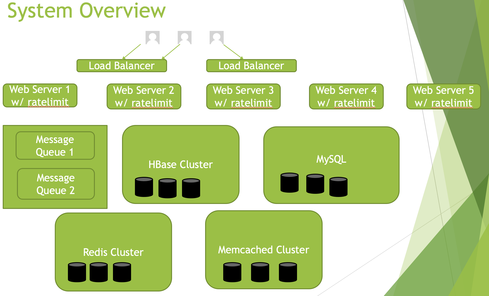
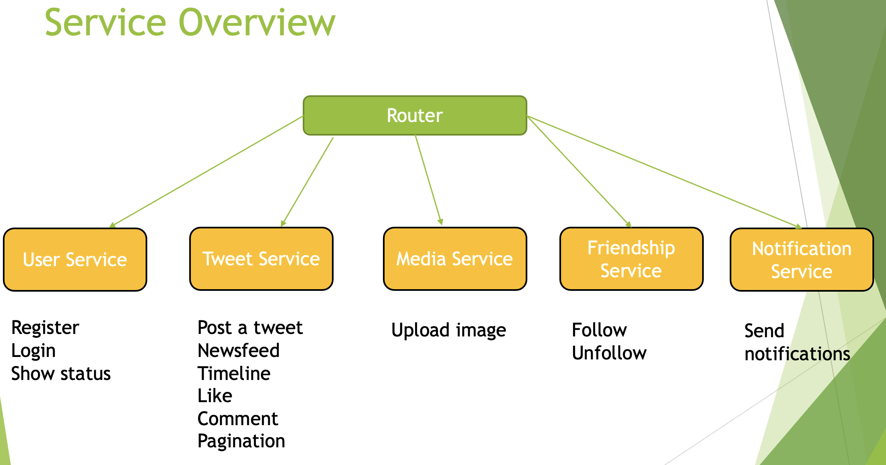
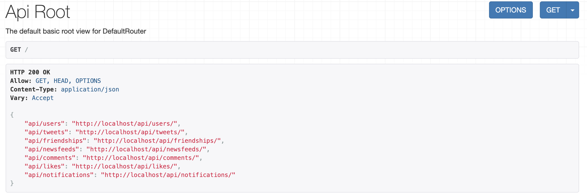
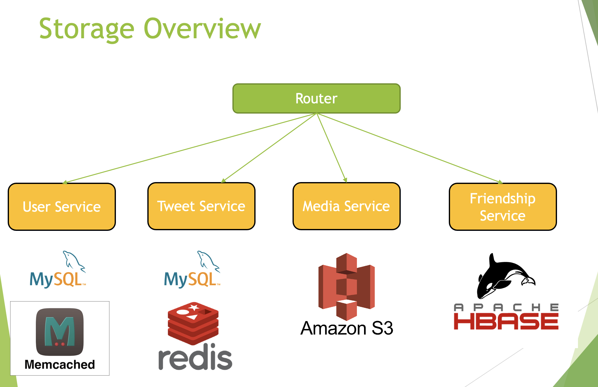
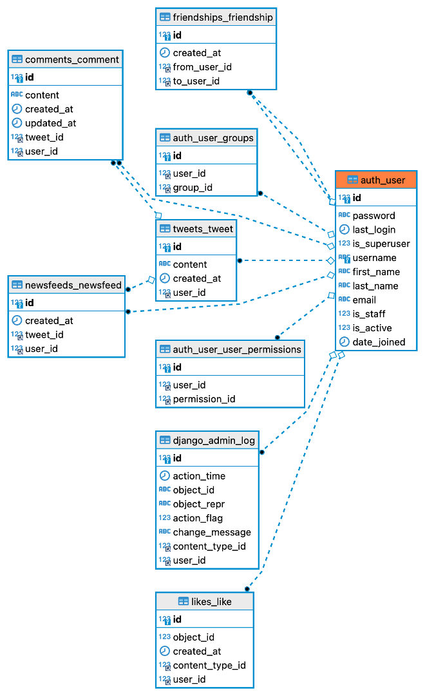
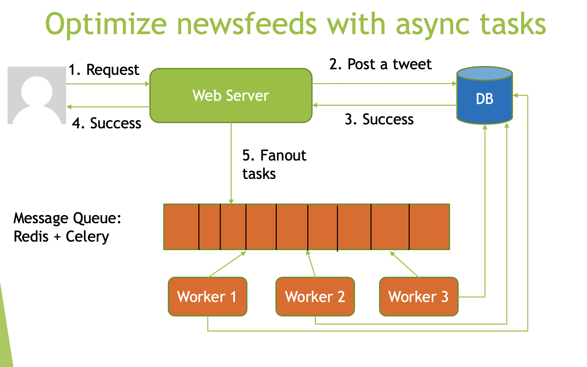
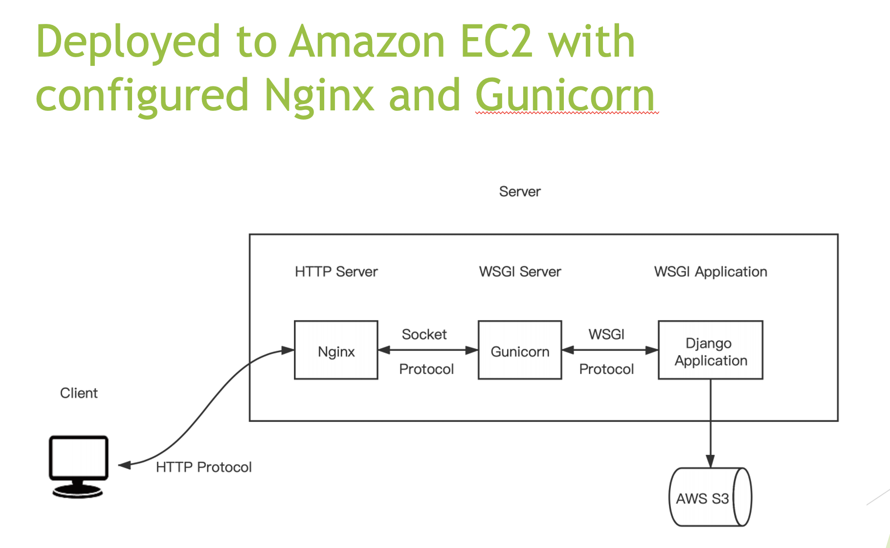

# twitter-webapp

## General
• Developed the twitter backend system with high concurrency and high availability by using Python based Django

• Leveraged Redis and Celery to implement asynchronous task queue to optimize newsfeeds service

• Leveraged Redis and Memcached to cache user profiles, tweets, newsfeeds, number of comments and likes

• Utilized denormalization method to store the number of likes and comments to avoid N+1 queries in MySQL

• Leveraged HBase, Thrift, HappyBase to store friendships and Amazon S3 to store uploaded images

• Utilized Django Ratelimit to prevent malicious requests and implemented django notifications to send notifications

• Deployed to Amazon EC2 with configured Nginx and Gunicorn

## Design Illustration

## Service Illustration

## API Overview

## Storage Illustration

## Schema Overview

## Newsfeeds with Message Queue

## Deployment

